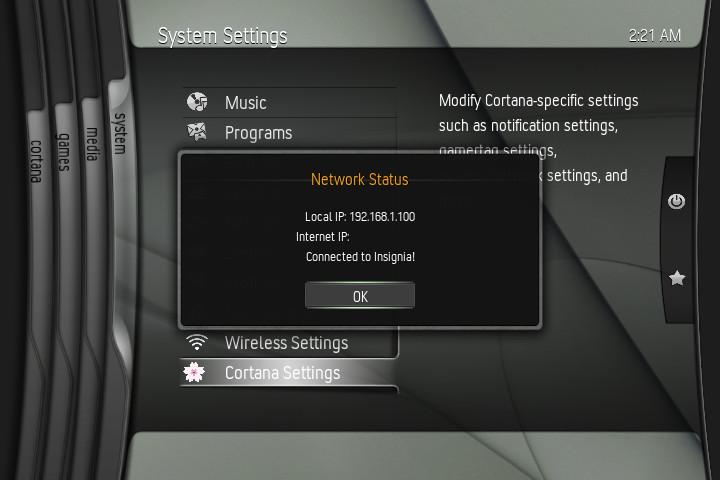

# Insignia Connection Test
Python-based XBMC4Xbox script that checks if your Xbox's DNS is properly connected to Insignia or not! Part of [Cortana Server Browser](https://github.com/faithvoid/script.cortanaserverbrowser).

## How to Install:
- Copy the "Insignia Connection Test" folder to "Q:\scripts\" on your Xbox
- Run it from your Scripts menu!
